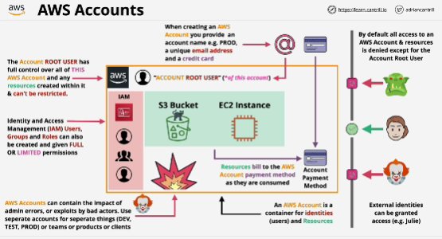

- **AWS Account** is a container for identites and AWS resources.

- AWS Account contains **users**, which you log in with, and **resources**, which you provision, inside that account.

- With **IAM** you can create other identites inside the account.

- Any IAM identity starts off with no permissions.

- You have to explicitly grant permissions to any identites managed by the IAM service.

