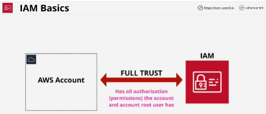
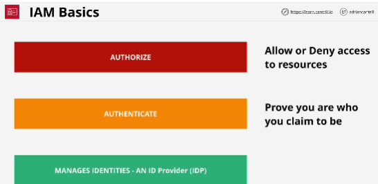
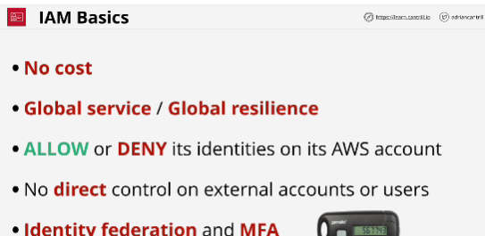

- IAM is what allows additional identities to be created within an AWS account - identities which can be given restricted levels of access.

- IAM identities start with no permissions on an AWS Account, but can be granted permissions (almost) up to those held by the Account Root User.

- **Globally resilient service**: any data is always secure across all AWS regions.

- **Roles** are generally used when you want to grant access to services in your account to an uncertain number of entites.

- **IAM policy/policy document** can be used to allow or deny access to AWS services when and only when they're attached to IAM Users, groups or roles.

- **ID provider** is a service that allows you to create and manage identites.

- **Authentication process** where you are challenged to prove that you are identity that you are claiming to be.

