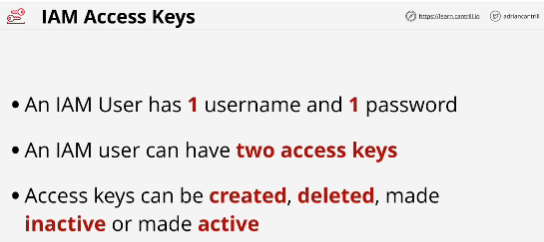
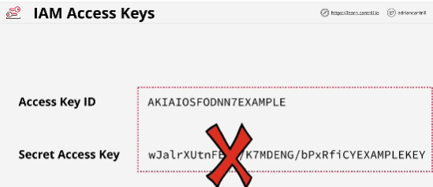

- **Access keys** are how the AWS Command Line Tools (CLI Tools) interact with AWS accounts.

- **Rotating access keys**: create a brand new set and remove the old one.

- IAM users are the only identity which uses access keys.

- IAM roles don't use access keys.

