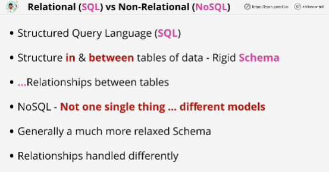
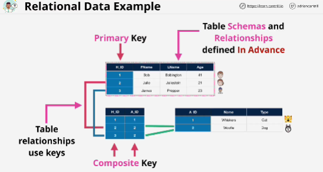
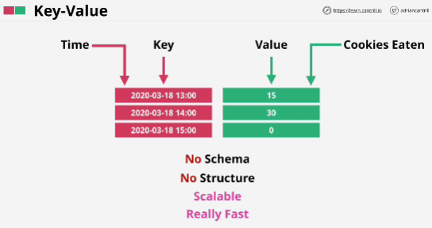
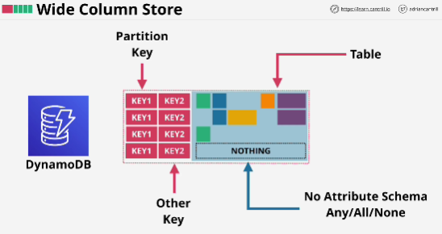
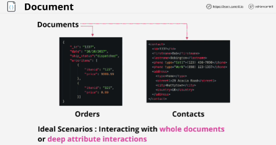
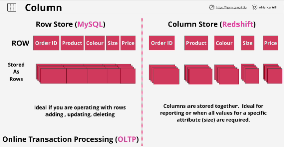
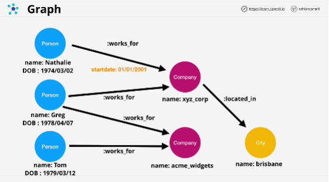

**Structured Query Language (SQL)** language used for store, update, and retrieve data.
**NoSQL**: tables are handled very differently

## NoSQL 

- **Key-Value** databases:
    - just a list of keys and value pairs
    - as long as every single key is unique, then the value doesn't matter
    - it has no real schema
    - no structure
    - adjust very fast, it's simple data with no structure
    - you write a value to a key, and you read a value from a key

    
- **Wide Column Store** (DynamoDB):
    - each row or item has one or more keys, generally one of them is called the partition key
    - optionally you can have *additional keys* (in AWS DynamoDB is called the **range key**)
    - offer groupings of items called tables
    - every item in a table can also have attributes but they don't have to be the same between items
    - every item can have any attribute
    - **every item inside a table has to use the same key structure and it has to have a unique key**
    - it's very fast, super scalable

- **Document** database:
    - designed to store and query data as documents
    - documents are structured using (JSON, XML)
    - work best for scenarios like order databases or collections or contact style databases, interact with deep atributes 
    - provide flexible indexing 
    - good for catalogs, user profiles where each document is unique but it changes over time
    - each document has a unique ID, and the database has access to the structure inside the document
    - provide flexible indexing 

- **Column** databases:
    - *Row based databases* are where you interact with data based on rows. If you need to read the price of one order from the database, you read the whole row from disk.
    Row based databases are ideal when you operate on rows, creating a row or updating a row or deleting a rows. Often calls OLTP (online transaction processing databases)

    - *Column database* store data based in columns.  
    Really good for reporting and analytics. 

- **Graph** databases:
    - Relationships between things are formally defined and stored in the database itself along with data. 
    - *Nodes* -> objects
    - Relationships between nodes *edges* (edges have a name and a direction)
    - can store a massive amount of complex relationships between data or between nodes, inside a database
    - good for social media, HR, system with complex relationships

