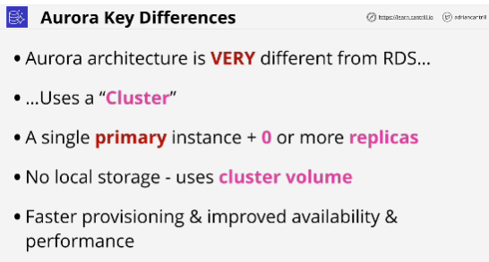
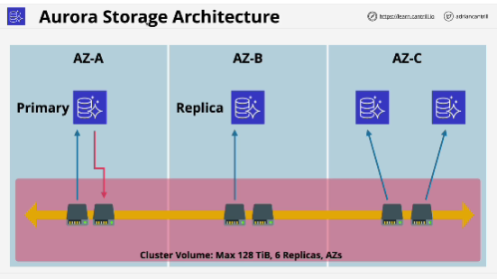
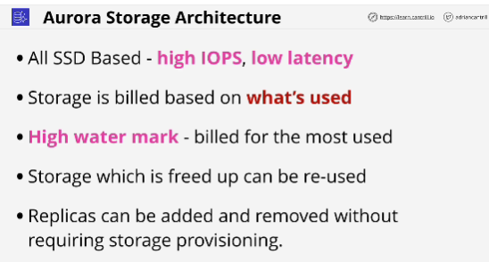
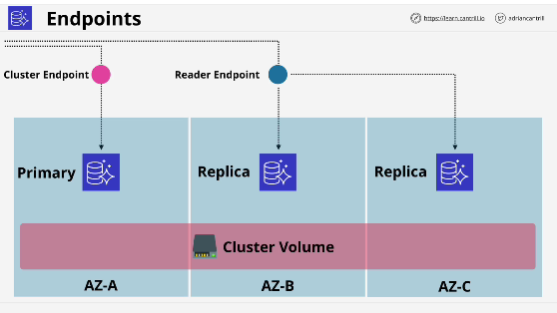
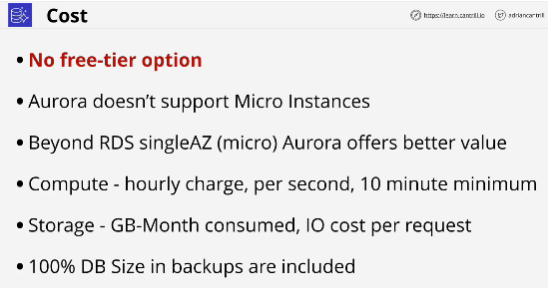
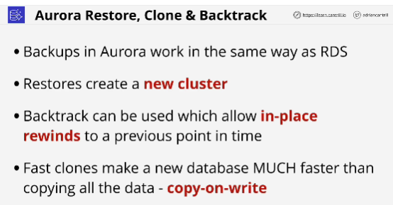

- Base entity: **cluster**

- Cluster is made of:
    - a single primary instance
    - 0 or more replicas
- Replicas witthin Aurora can be used for reads during normal operation, it's not like standby replica inside RDS.

- Replicas inside Aurora can provide the benefits of both RDS multi-AZ and RDS read replicas.

- Aurora doesn't use local storage for compute instances. Instead, an Aurora cluster has a shared cluster volume. This is storage which is shared and available to all compute instances within a cluster.

- Cluster has shared storage which is SSD based. 
When data is written to primary DB instance Aurora synchronously replicates that data across all of these six storage nodes spread across the AZ which are associated with your cluster. 

- All instances inside cluster, primary and all the replicas, have access to all of these storage nodes. 
- Replication happens at the storage level.
- By default, the primary instance is the only instance able to write to the storage and the replicas and the primary can perform read operations.

- Aurora automatically detects failures in disk volumes that make up the cluster shared storage. 

- With Aurora you can have up to 15 replicas.

- AURORA clusters, like RDS clusters, use endpoints. 
These are DNS addresses which are used to connect to the cluster.
Unlike RDS, Aurora have multiple endpoints that are available for an application.

- **Cluster endpoint** always points at the primary instance and that's the endpoint that can be used for read and write operations.

- **Reader endpoint** also point at the primary instance if that's all that there is, but if there are replicas, then the Reader endpoint will load balance across all of the available replicas, and this can be used for read operations. 

- **Custom endpoints**: to each instance, primary and any of the replicas have their own unique endpoint.

- **Backtrack** is something that needs to be enabled on a per cluster basis and it allow you to roll back your database to a previous point in time.

- **Fast clon** alows you to create a brand new database from an existing database but it doesn't make a one-for-one copy of the storage for database. It references the original storage and it only stores any differences between those two.

