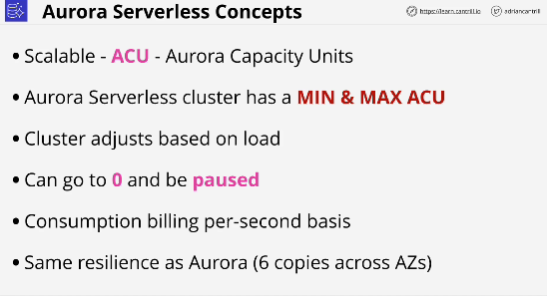
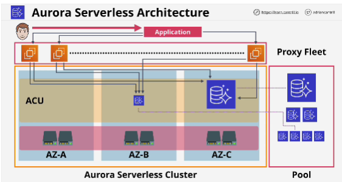
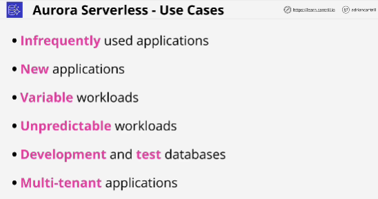

- Aurora Serverless is a service which is to Aurora what Fargate is to ECS.

- With Aurora Serverless you don't need to provision resources it the same way as you did with Aurora provisioned, you still create a cluster but Aurora Serverless uses the concept of ACUs (Aurora Cpacity Units)

- The ACUs are stateless, they're shared across many AWS customers and they have no local storage so they can be allocated to your Aurora serverless cluster rapidly when required.

- If the load on an Aurora serverless cluster increases beyond the capacity units which are being used and assuming the maximum capacity setting of the cluster allows it, then more ACUs will be allocated to the cluster. 

- In Aurora serverless we have a shared **proxy fleet** which is managed by AWS.

- **The only thing you need to worry about an Aurora serverless cluster is picking the minimum and maximum values for the ACU.**

