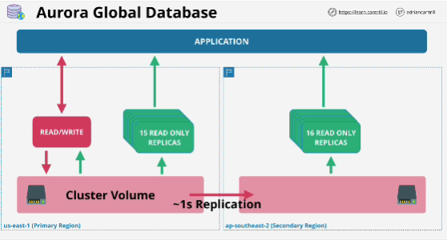
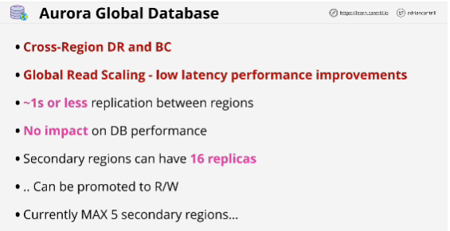

- **Global database allow you to create global level replication using Aurora from a master region to up to five secondary AWS regions.**

- **Primary region** 
- Global databases introduce the concept of **secondary regions**: entire secondary cluster is read-only
- Replication from primary region to secondary region occurs at the storage layer.

