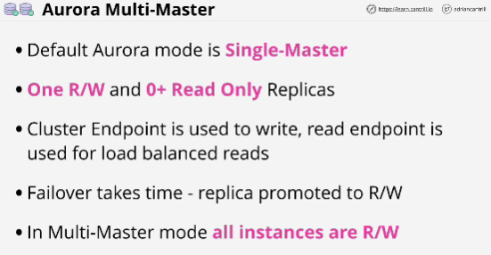
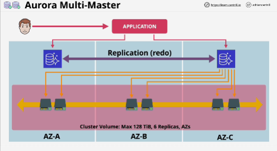

- This feature allows an Aurora cluster to have multiple instances, which are capable of performing both reads and writes.

- **There is no cluster endpoint to use.**

- An application is responsible for connecting to instances witin the cluster. 

- Writing instance is looking for is a **quorum** of nodes to agree.
- With a multi-master cluster, change is replicated to other nodes in the cluster.

