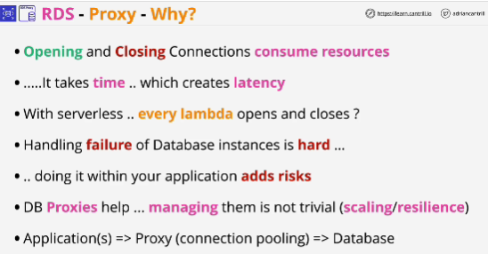
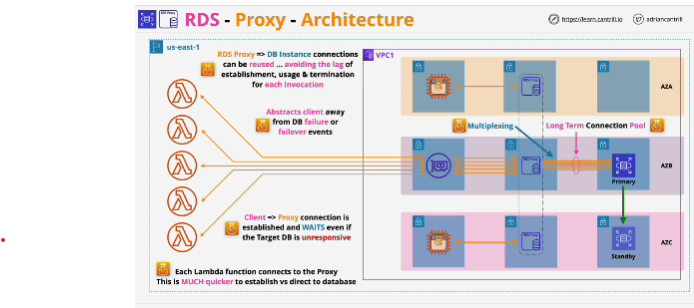
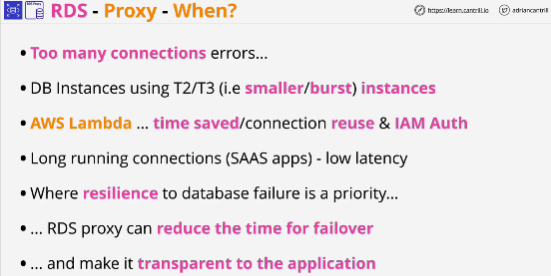
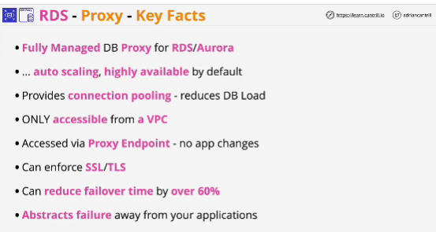

- Amazon RDS Proxy is a fully managed, highly available database proxy for Amazon Relational Database Service (RDS) that makes applications more scalable, more resilient to database failures, and more secure.

- At a high level, RDS Proxy does or indeed any database proxy is change your architecture. 
Instead of your application connecting to a database every time they use it, instead, they connect to a proxy and a proxy maintains a pool of connections to the database which are open for the long term.

- You can have smaller number of actual connections to the database vs the connections to the database proxy.

- Proxy is managed service and it runs only from within a VPC.

- Multiplexing is used so that a smaller number of database connections can be used for a larger number of client connections and this helps reduce the load placed on the database server even more. 

- RDS Proxy helps with database failure or failover events. 

## Use case scenarios
RDS Proxy helps reduce the number of connections to a database. 

Clients are connected to the single RDS Proxy Endpoint even if a failover event happens in the background.

## EXAM

