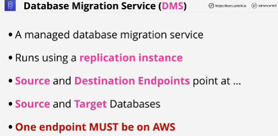
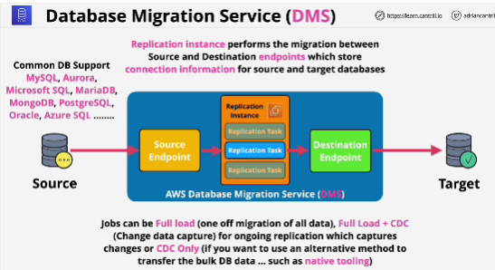
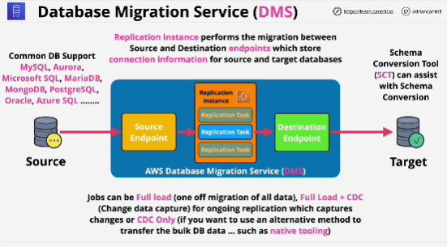
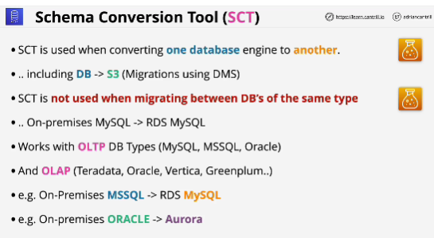
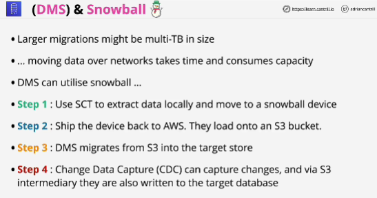

- The Database Migration Service (DMS) is a managed service which allows for 0 data loss, low or 0 downtime migrations between 2 database endpoints.

The service is capable of moving databases INTO or OUT of AWS.

- Source and destination endpoints store the replication information so the replication instance and task can access the source and target database.

- DMS is a great tool for migrating databases from on-premises to AWS.

- No downtime migration: DMS

## Schema conversion tool (SCT)

- Standalone application, which is only used when converting from one database engine to another. 

- It can be used for larger migrations.

## Snowball

## EXAM 
SCT is only used for migrations when the engine is changing.

