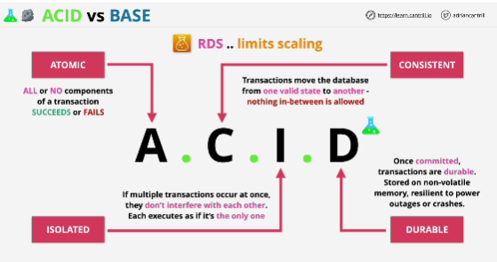
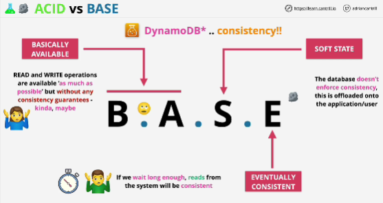

- Two transaction models 

- **CAP theorem**: 
    Consistency -> every read to a database will receive the most recent write or it wil get an error

    Availability -> every request will receive a non error response but without the guarantee that it contains the most recent write

    Partition Tolerant -> system can be made of multiple network partitions, and the system continues to operate, even if there are a number of dropped messages or errors between network nodes
Any database product is only capable of delivering a maximum of two of these different factors.

ACID focuses on consistency
BASE focuses on availability

## ACID
ACID means that transactions are:
- **ATOMIC** means either all part of a transaction are successful or non of the parts of a transaction are successful

- **CONSISTENT** transaction applied to the database move the database from one valid state to another

- **ISOLATED** because transactions to a database often executed in parallel, they need not to interfere with each other. Ensures that concurrent executions of transactions leave the database in the same state that would have been obtained if transactions were executed sequentially

- **DURABLE** once a transaction has been commited, it will remain commited even in the case of a system failure

Referring to any of the RDS databases.
ACID limits the ability of a database to scale.

## BASE
- **BASICALLY AVAILABLE** 
- **SOFT STATE** application needs to deal with the possibillity that the data that you're reading isn't the same data that was written moments ago
- **EVENTUALLY CONSISTENT**

By default, a BASE transaction model means that any reads to a database are eventually consistent.

Databases which use BASE can deliver high performance, they are scalable.

DynamoDB works in a BASE way. It offers both ecentually and immediately consistent reads.

BASE = noSQL style database

## EXAM
if you see noSQL or DynamoDB mentioned together with ACID, then it might be referring to DynamoDB transactions. 

