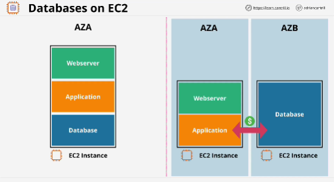
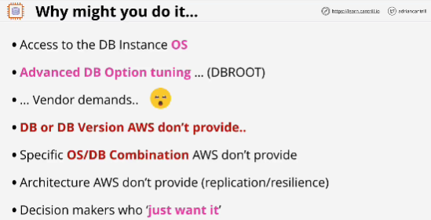
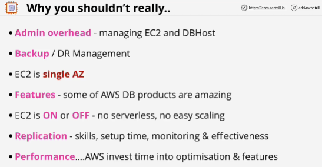

Why to run databases on EC2?
- need access to OS of the database (other AWS products don't give you OS level access)
- some things which can only be done with ROOT level access
- you might need to run a database or a database version, which AWS don't provide

Why you shouldn't put a database product on EC2?
- admin overhead of managing the EC2 instance as well as the database host, the database server
- backup
- EC2 is running in a single AZ
- EC2 is ON or OFF
- Replication
- Performance

