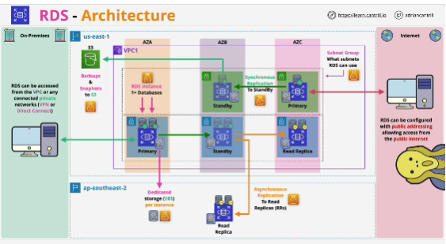

- Database as a Service product is where you pay money and in return you get a database.

- With RDS you pay for and receive a database server, so it would be more accurate to call it a database server as a service product.
On this database server, or instance, you can have multiple databases.

- RDS provides a managed version of a database server that you might have on-premises, only with RDS, you don't have to manage the hardware, the OS, or the installation

- With RDS you have a range of database engines to use, MySQL, MariaDB, PostgreSQl, Oracle and Microsoft SQL.

- **Amazon Aurora** is a different product. Amazon Aurora is a custom database engine and product created by AWS which has compatibility with some of the above engines, but it was designed entirely by AWS. 

- RDS is managed database server as a service product.  
You don't have access to operating system or SSH access.

- RDS is a service which runs within a VPC, so it's not a public service like S3 or DynamoDB, it needs to operate in subnets within a VPC in a specific AWS region. 

- RDS instances can have multiple databases on them. 
- Every RDS instance has its own dedicated storage provided by EBS. 
If you choose to use Multi-AZ, then the primary instances replicate to the standbys using synchronous replication. This means that the data is replicated to the standby as soon as it's received by the primary.

*Read replicas* use asynchronous replication and they can be in the same region, but also other AWS regions. 

- Backups of RDS: backup occur to S3

**RDS Costs**
You billed for resource allocation
1. You've got the instance size and type (the bigger and more featture-rich the instance, the greater the cost)
2. Choice of whether multi-AZ is used or not (multi-AZ menas more than one instance there's going to be additional cost)
3. Per gig monthly fee for storage, which means the more storage you use, the higher the cost
4. Data transfer cost (cost per gig of data transfer in and out of your DB instance, from or to the internet and other AWS regions)
5. Backups & snapshots (you get the amount of storage that you pay for for the database instance in snapshot storage for free)
6. Extra cost based on using commercial DB engine types