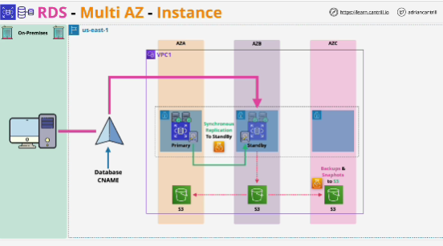
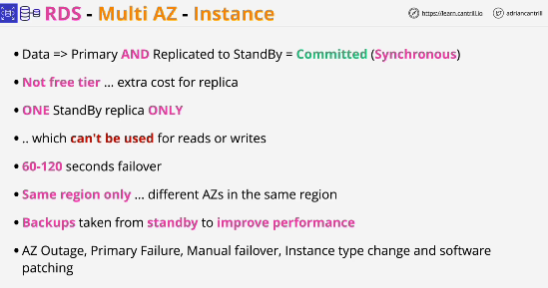
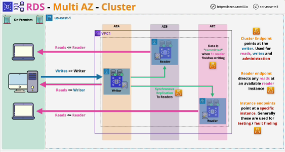
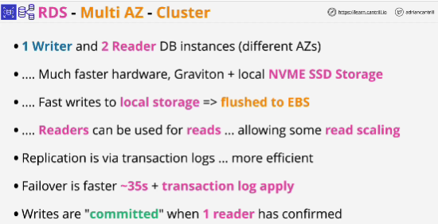

**MultiAZ instance depoloyment**: with this architecture, RDS has a primary database instance containing any databases that you create and when you enable MultiAZ mode, this primary instance is configured to replicate its data synchronously to a standby replica which is running in another AZ and this means that this standby also has a copy of your databases.

- Replication is at the storage level.

- All the accesses to the databases are via the database **CNAME** (this is a DNS name which by default points at the primary database instance)

- With multiAZ instance architecture you always access the primary database instance.

- Instead of pointing at the primary it points at the standby which becomes the new primary. 

- Replication between primary and standby is synchronous and what this means is that data is written to the primary and then immediately replicated to the standby before being viewed as commited. 
- MultiAZ doesn't come with free tier
- **You only have one standby replica** and this replica cannot be used for reads or writes (its job is to simply sit there and wait for failover events)
- MultiAZ can only be within the same region
- Backups can be taken from the standby replica to improve performance and failovers will ocur for various different reasons such as AZ outage
- You can use failover to move any consumers of your database onto a different instance, patch the instance which has no consumers and then flip it back. 

## Multi-AZ Cluster
*Difference between Multi-AZ Cluster and Aurora*: 
- with this mode of RDS Multi-AZ, you can have two readers only; these are in different AZ than the writer instance but there will only be two whereas with Aurora you can have more;
- in RDS Multi-AZ mode each instance stil has its own local storage (in Aurora, you access the cluster using a few endpoint types:
    - **cluster endpoint**: like the database CNAME, it points at the writer and can be used for reads and writes against the database or administration functions)
    - **reader point**: points at any available reader within the cluster (in some case this does include the writer instance, the writer can also be used for reads)
    - **instance edpoints**: each instance in the cluster gets one of these (it's not recommended to use them directly, only use them for testing and fault finding)

*Difference between Multi-AZ Cluster and instance mode*: readers are usable with Multi-AZ Cluster; writer - primary instance within Multi-AZ Cluster and it can be used for writes and read operations; 
In instance mode reader instance can be used only for read operations.

Multi-AZ Cluster - replication between the writer and the readers: while data is sent to the writer and it's viewed as being commited when at least one of the readers confirms that it's been written.

