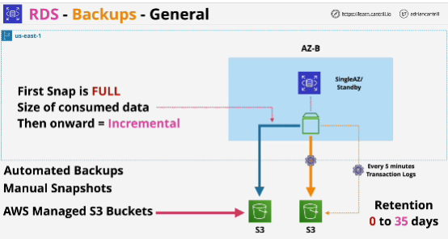
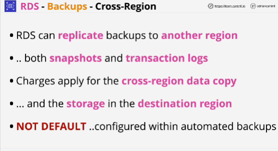
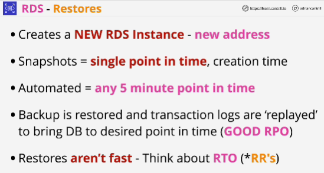

Two types of backups:
1. Automated backups
2. Snapshots
- Both of these backups are stored in S3, but they use AWS-managed buckets so they won't be visible to you within your AWS console.
- You can see backups in the RDS console, but you can't move to S3 and see any form of RDS bucket which exists for backups

- Benefits of using S3: any data contained in backups is now regionally resilient because it's stored in S3, which replicates data across multiple AWS AZs within that region. 

- Snapshots aren't automatically: they run things explicitly or via script or custom application. You have to run them against an RDS instance. 
- **Snapshots don't expire, you have to clear them**
- You can run one snapshot per month, one per week, one per day, one per hour
- The lower the timeframe between snapshots, the lower the maximum data loss that can occur when you have a failure.

## Automated backups
- This occur once per day

- Every 5 minutes, database transaction logs are also written to S3.

- transaction logs store the actual operations which change the data (a five-minute Recovery Point Objective can be reached)

- They're automativally cleared up by AWS and for a given RDS instance, you can set a retention period from zero to 35 days.
- Zero -> automated backups are disabled
- 35 days -> you can restore to any point in time over that 35-day period using the snapshots and transaction logs.
- Data older then 35 day is automatically removed.

- When you delete database you can chose to retain any automated backups, but they still expire based on the retention period.
If you delete an RDS instance, you need to create a final snapshot.

## RDS - Restores
- Creates a new RDS instance when you restore an automated backup or a manual snapshot.
- When you restore manual snapshot you're restoring the database to a single point in time.

RDS automated backups are great as a recovery to failure or as a restoration method for any data corruption, but they take time to perform a restore.