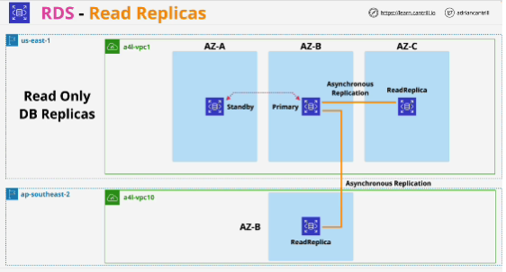
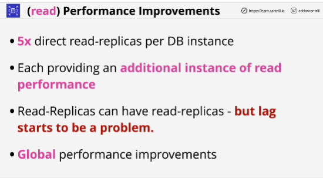
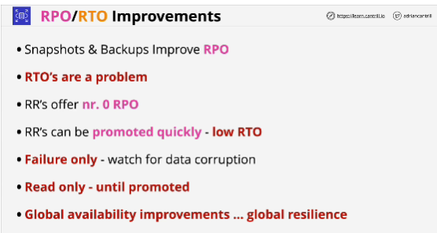

Benefits:
- provide performance benefits for read operations
- they help us create cross-region failover capability
- they provide a way for RDS to meet really low recovery time objectives

- Read replicas are **read only** replicas of an RDS instance 
- You can use read replicas only for read operations 
- Read replicas aren't part of the main database instance in any way. They have their own database endpoint address and so applications need to be adjusted to use them.

- Multi-AZ uses synchronous replication and that means that when data is written to the primary instance, at the same time as storing that data on disk on the primary, it's replicated to the standby.

- With asynchronous, data is written to the primary first, at which point it's viewed as commited, then, after that, it's replicated to the read replicas. 

- **synchronous means multi AZ, asynchronous means read replicas**

- Read replicas can be created in the same region as the primary database instance, or they can be created in other AWS regions, known as cross-region read replicas.

## Importance of read replicas
1. read performance and read scaling for a database instance

2. read replicas benefit in terms of recovery point objectives and recovery time objectives

Data that is on read replica is synced from the main database instance. 

You should only look at using read replicas during disaster recovery scenarios when you're recovering from failure.

When read replica is promoted, you're able to use them as a normal RDS instance.

