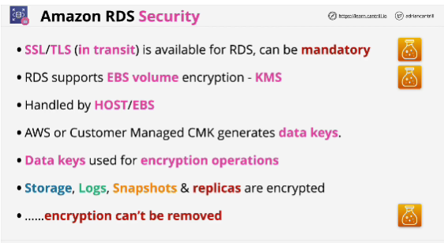
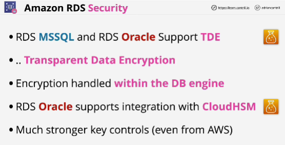
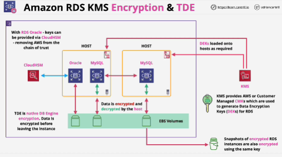
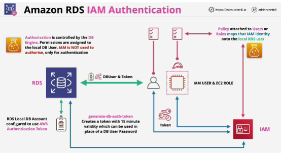

**Encryption in transit**: data between the client and the RDS instance is encrypted via SSL or TLS.

RDS Oracle supports TDE using CloudHSM - the encryption process is even more secure with even stronger key controls because CloudHSM is managed by you with no exposure to AWS.

KMS generate and allows usage of CMKs, which themselves can be used to generate data encryption keys known as DEKs.
THese encryption keys are loaded onto the RDS hosts as needed and are used by the host to perform the encryption or decryption operations. 

## IAM Authentication

- Attached to roles and users are policies.
- Policies contains a mapping between that IAM entity, user or role, and a local RDS database user.

- This allows those identities to run a generate-db-auth-token operation, which works with RDS and IAM.
Baesd on the policies attached to the IAM identities, it generates a token with a 15-minute validity.

This token can be used to log in to the database user within RDS without requiring a password.

**The permissions over the RDS database inside the instance are still controlled by the permissions on the local database user, so authorization is still handled internally.**

This process is only for authentication, which involves IAM, and only if you specifically enable it on the RDS instance.

