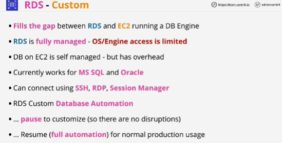
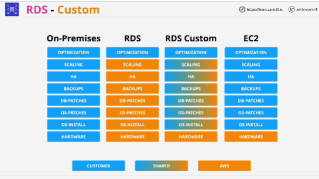

- RDS is a fully-managed database server as a service product.

- RDS Custom gives you the ability to occupy a middle ground where you can utilize RDS, but still get access to some of the customatizations that you have access to when running your own DB engine on EC2.

- RDS Custom, unlike RDS, is actually running **within your AWS account.** (you will see EBS volumes, and backups inside your AWS account)

- With RDS, the networking works by injecting elastic network interfaces into your VPC.

**Snapshots that are taken manually are not managed by RDS in any way.**

**Restore with a normal RDS will create a brand new database instance. It will have brand new database endpoint DNS name the CNAME and you will need to update any application con figuraion to this brand new database.**

**When you are restoring a normal RDS snapshot, you're restoring it to a brend new database instance, its own instance with its own data and its own DNS endpoint name.**

It currently works for Oracle and MS SQL