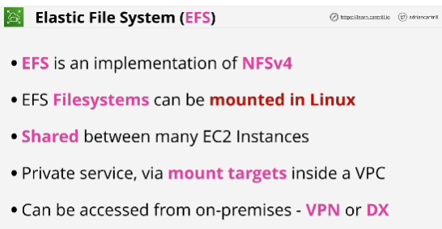
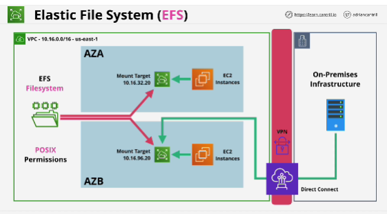
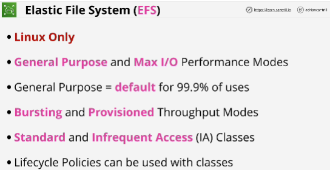

- The EFS service is an AWS implementation of a fairly common shared storage standard called NFS (Network File System), specifically version 4 of the network file system.

- With EFS you create file systems which are the base entity of the product and these file systems can be mounted within EC2 Linux instances.

- Linux uses a tree structure for its file system. Devices can be mounted into folders in hierarchy. 

- EFS file systems can be mounted on many EC2 instances so the data on those file systems **can be shared between lots of EC2 instances.**

- **File system is base entity of the EBS.**
- File system needs to have **mount targets.**

- EFS limitation: media for posts, images, movies, audio, they're all stored on the local instance itself.
If instance is lost, media is also lost.

- EFS storage exists seperately from an EC2 instance.

- EBS is block storage, EFS is file storage.

- EFS is private service.

- EFS is accessible outside of a VPC using hybrid networking products.

## EXAM

- EFS is for Linux only instances. 

- Two performance models:
1. **General purpose**: ideal for latency sensitive use cases, web servers, content management systems, home directories
2. **MAX I/O**: suits applications that are highly parallel, big data media processing  

General purpose is default

- Two different throughput modes:
1. **bursting**: works like GP2 volumes inside EBS (default)
2. **provisioned**: scales with the size of the file systems, you can specify throughput requirements seperate from the amount of data you store

- Two storage classes available:
1. **standard**: used to store frequently accessed files (default)
2. **infrequent access**: lower cost storage class

