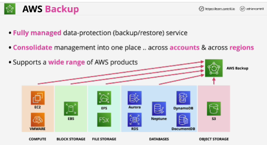
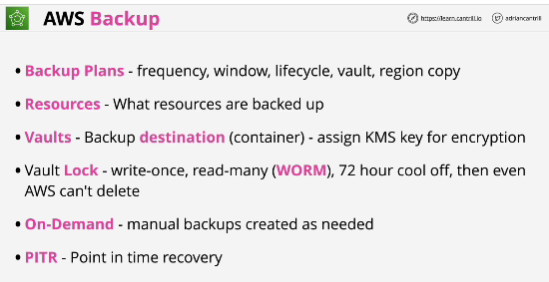

- You can configure **life cycles** which define when a backup is transitioned to cold storage and when it exprires.
- When you transition a backup into cold storage it needs to be stored there for a minimum of 90 days.
- They allow you to configure region copy so you can copy backups from one region to another.

- **Valuts**: you need to configure at least one of these. By default they are read and write meaning that backups can be deleted but you can also enable AWS Backup Vault Lock.
- **AWS Backup Vault Lock** enables a write-once, read-many, known as WORM mode for the vault.

- **Point in time recovery** method: S3 and RDS. You can restore to the state of that resource to specific data and time within the retention window.

