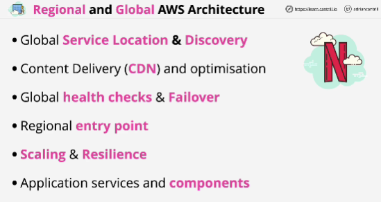
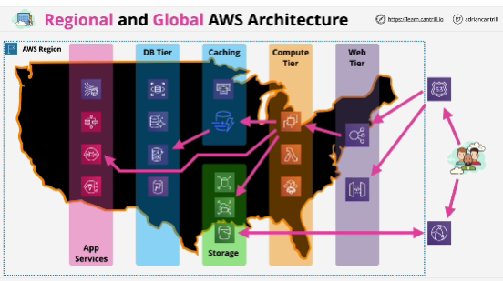

- Three main types of architectures:
1. **small scale architectures** which will only ever exist in one region or one country.
2. Systems which also exist in one region or country but where there's a DR requirement so if that region fails for some reason, then it fails over to a secondary region.
3. Systems that operate within multiple regions and need to operate through failure in one or more of those regions.

- The purpose of web tier is to act as an entry point for your regional based applications or application components.

- Functionality provided to the customer via the web tier is provided by the compute tier using services such as EC2, Lambda or containers which use the elastic Container service.

- Compute tier consume storage service.

- Most environments reqiure data storage. (RDS, Aurora, DynamoDB, Redshift)

- In order to improve performance, most applications don't directly access the database, instead they go via a **caching layer**.

