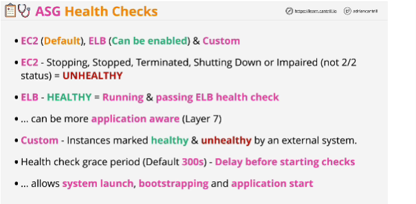

- If instance fails a health check, then it's replaced within the Auto Scaling group.

- Three types of health checks which can be used with Auto Scaling group:
1. **EC2** -> DEFAULT anything but the instance is running is viewed as **unhealthy**

2. **ELB checks** which can be enabled on an Auto Scaling group; instance needs to be both running and it needs to be passing the load balance a health check.

3. **Custom health checks** is where an external system can be integrated and mark instances as healthy or unhealthy.

## EXAM
- **Health check grace period** is really useful if you're performing bootstrapping with EC2 instances which are launched by the Auto Scaling group.

