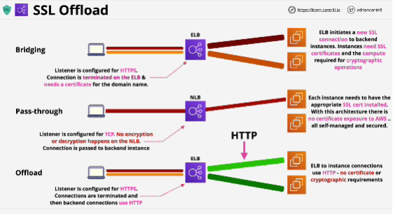
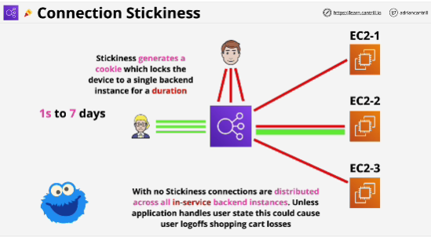

- **Session stickiness** is designed to allow an application to function using a load balancer, if the state of the user session is stored on an individual server.

- Three way that load balancer can handle secure connections:

1. **Bridging**: DEFAULT, one or more clients makes one or more connections to a load balancer. 
- Load balancer is configured so that its listener uses HTTPS. 
- SSL connections occur between the client and the load balancer. 
- Load balancer needs an SSL certificate, which mathces the domain name that the application uses.
- AWS do have some level of access to that certificate.
- If you're in situation where you need to be really careful about where your certificates are stored, then potentially you might have a problem with bridged mode.
- Application load balancer in bridging mode can actually see the HTTP traffic, it can take actions based on the contents of HTTP.
- Every EC2 instance needs to perform cryptographic operations.

- Positive: Elastic Load Balancer gets to see the unencrypted HTTP and can take actions based on what's contained in this plain text protocol. 
- Negative: the certificate does need to be stored on the load balancer itself an that's a risk. EC2 instances also need a copy of that certificate, which has an admin overhead.
------
2. **Pass through**: client connects, but the load balancer just passes that connection along to one of the back end instances. 
- The instances still need to have the SSL certificates installed, but the load balancer doesn't. 
- Load balancer is configured to listen using TCP. (it can see source and destination IP addresses and ports but it never touches the encryption)
- AWS never need to see the certificate that you use, it's managed and controlled entirely by you.

- Negative: you don't get to perform any load balancing based on the HTTP part. The instances still need to have the certificates and still need to perform the cryptographic operations, which uses compute.
-----
3. **Offload**: client connect to the load balancer in the same way using HTTPS. The connection use HTTPS and terminated on the load balancer. It needs SSL certificate which matches the name that's used by the application. 
- Load balancer is used to connect to the back end instances using HTTP so the connections are never encrypted again. 
- Data is encrypted between customers and the load balancer all the time using the public internet.
- EC2 only need to handle HTTP traffic.

- Negative: data is in plain text form across AWS network.

## Connection Stickiness 
- Within an application load balancer, this is enabled on a target group.
- If this is enabled, the first time that a user makes a request, the load balancer generates a cookie calles AWSLAB.
This cookie has a duration which you define when enabling this feature. (1s to 7 days)
- This situation of sending sessions to the same server, this will happen until one of two things occur:
    1. if we have a server failure, then one particular user will be moved over to a different EC2 instance.
    2. cookie can expire - user will receive a new cookie and be allocated a new back end instance

