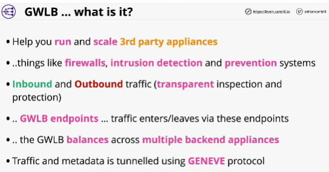
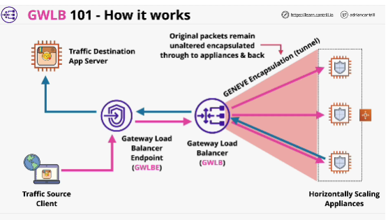
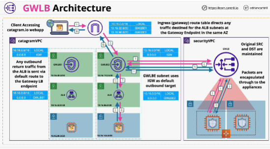

- **Gateway Load Balancers** enable you to deploy, scale, and manage virtual appliances, such as firewalls, intrusion detection and prevention systems, and deep packet inspection systems. It combines a transparent network gateway (that is, a single entry and exit point for all traffic) and distributes traffic while scaling your virtual appliances with the demand.

- Two major components:
1. **Gateway load balancer endpoints** which run from a VPC where the traffic you want to monitor, filter or control originates from, or is destined to.
2. **Gateway load balancer** loads balances packets across multiple backend instances. Use a protocol called GENEVE (tunneling protocol)
Tunel is created between Gateway load balancer and the backend instances, so the security appliances, packets are encapsulated and sent through this tunnel to the appliances

- Benefits: Gateway load balancer will load balancer across security appliances, so you can horizontally scale. 
It allows third party appliances to be used in a scalable way. 

- The Gateway load balancer manage **flow stickiness**, so one flow of data will always use one appliance. 

