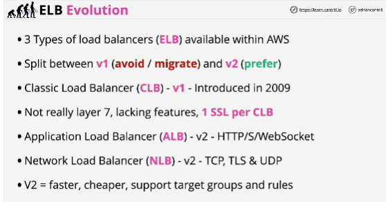

- **Classic Load Balancer** can load balance HTTP and HTTPS, as well as lower level protocols, but they aren't really Layer 7 devices. More expensive to use. Limitation: only support one SSL certificate per load balancer. 

- **NOT USE BY DEFAULT** classic load balancers.

- **Network load balancers** are type of load balancer that you pick for application which don't use HTTP or HTTPS.

