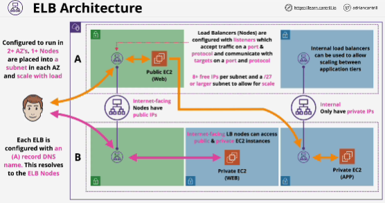

- It's the job of a load balancer to accept connections from customers and then to distribute those connections across any registered backend compute. 

- Physical infrastructure is abstracted - hidden from customer.

- You need to pick up whether you want to use IPv4 only or dual Stack (IPv4 and newer IPv6)
- You need to pick AZ which load balancer will use.

- Based on subnets that you pick inside AZs when you provision a load balancer the product places into these subnets one or more load balancer nodes.

- When load balancer is created it gets created with a single DNS record -> A record (A record points at all of the Elastic Load Balancer nodes that get created with the product)

## EXAM
- **When creating load balancer, you need to decide whether that load balancer should be internet-facing, or whether it should be internal.** This choice (internet-facing or internal) controls IP addressing for the load balancer nodes. 

- **internet-facing**: the nodes of that balancer are given public addresses and private addresses; it can be connected to from the public internet, it can connect both to public and private EC2 instances; **instances that are used do not have to be public**; only requirement is that load balancer nodes can communcate with the backend instanes;

- **internal**: the nodes only have private IP addresses.

------

- **Listener configuration**: this configuration controls what the load balancer is listening to.

- Load balancer in order to function need 8 or more free IP addresses in the Subnets that they're deployed into. 
AWS suggests that you use a /27 or larger subnet to deploy an Elastic Load Balancer in order that it can scale.

/28 and /27 are both correct in their own ways to represent the minimum subner size for a load balancer.

- **Internal load balancers** are architecturally like internet-facing load balancers except they **only have private IP's allocated to their nodes.** They are generally used to seperate different tiers of applications. 

