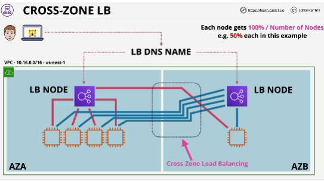
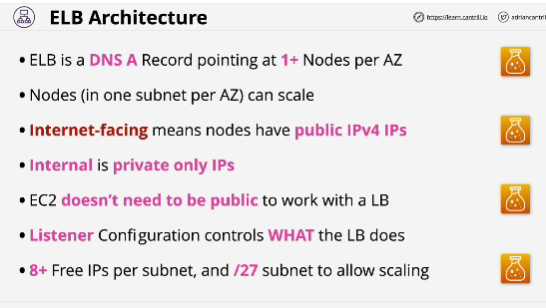

- Initially, load balancers could only distribute connections to instances within the same AZ.

- ** Cross-zone load balancer** allows every load balancer node to distribute any connections that it receives equally across all registered instances in all AZs.
Ability to distribute or load balance across AZs.

This feature is not enabled by default!

