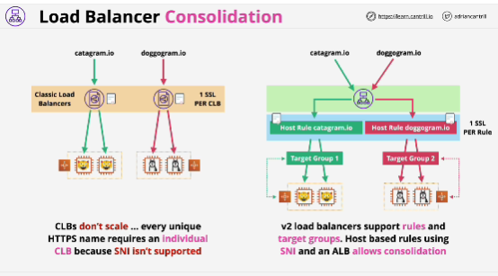
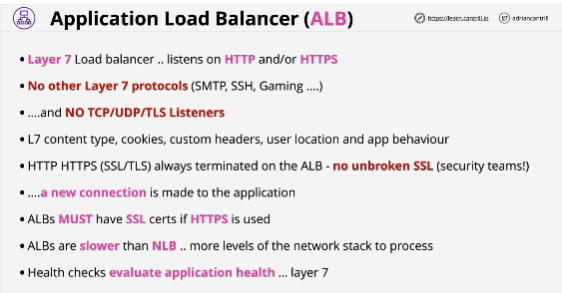
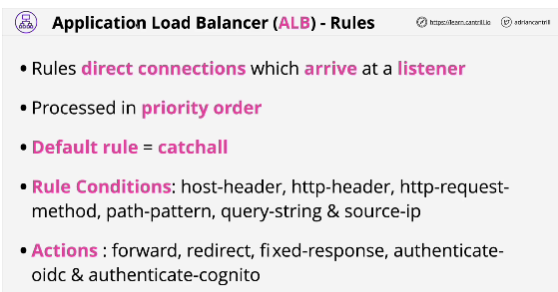
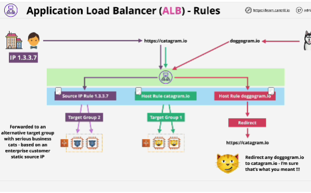
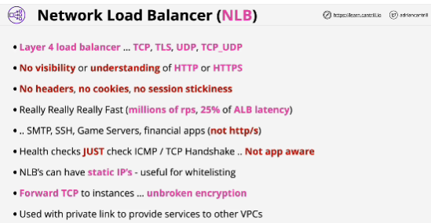
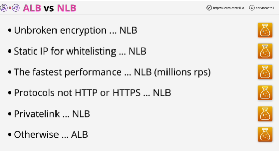

## EXAM
- If you need to forward encrypted connections through to the instances without terminating them on the load balancer, then you need to use a network load balancer.

- Network load balancers and TCP listeners is how you can do unbroken end-to-end encryption. 
You can forward unbroken channels of encryption directly from your clients through to your application instances.

- Network load balancers are also used for private link to provide services to other VPCs.

