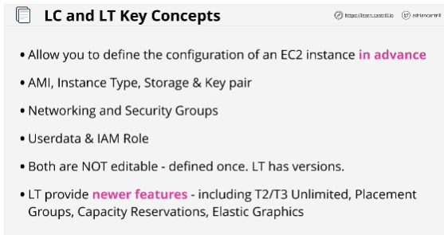
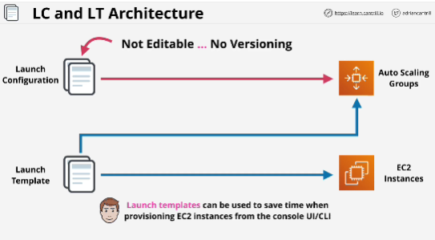

- Everything that you usually define at the point of launching an instance, you can define in launch configurations and launch templates.

- You define them once, and that configuration is locked.

- For launch configurations, versions aren't available.

- Auto scaling groups offer automatic scaling for EC2 instances, and launch configurations provide the configuration of those EC2 instances, which will be launched by Auto Scaling groups. 

