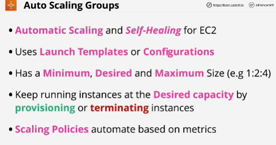
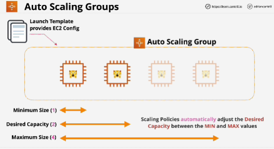
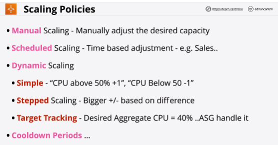
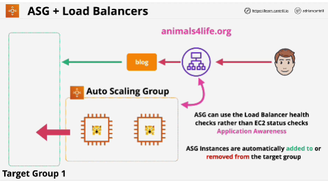
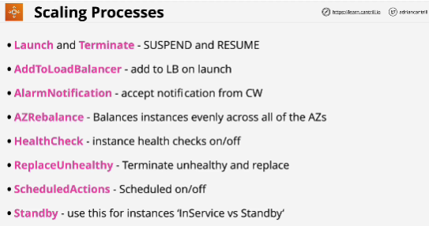
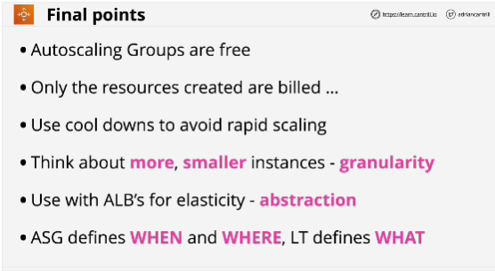

- An Auto Scaling group contains a collection of Amazon EC2 instances that are treated as a logical grouping for the purposes of automatic scaling and management.

- An Auto Scaling group also enables you to use Amazon EC2 Auto Scaling features such as health check replacements and scaling policies. Both maintaining the number of instances in an Auto Scaling group and automatic scaling are the core functionality of the Amazon EC2 Auto Scaling service.

- Used together with Elastic Load Balancers and launch templates to deliver elastic architecture.

- All instances launched using the Auto Scaling Group are based on the single configuration definition, either defined inside a specific version of a launch template or within a launch configuration.

- **Desired capacity always has to be more than the minimum size and less than the maximum size.**

- Scaling policies are used together with Auto Scaling Groups.

- Scaling policies can update the desired capacity based on certain criteria. 

- Architecturally Auto Scaling groups define where instances are launched, they're linked to a VPC and subnets within that VPC are configured on the Auto Scaling group, whatever subnets are configured will be used to provision instances into. 
When instances are provisioned there's an attempt to keep the number of instances within each AZ even.

- **Scaling policies** are rules which can adjust the values of an Auto Scaling group and there are three ways that you can scale Auto Scaling grous.

**Stepped Scaling** is almost always preferable to simple except when your only priority is simplicity.
**Target Scaling** lets you define an ideal amount of something.

- **Cooldown Period** is value in seconds. It controls how long to wait at the end of a scaling action before doing another.

- Auto Scaling groups monitor the health of instances that they provision by default this uses the EC2 status checks.

- SELF-HEALING

- If you create a launch template which can automatically build an instance then create an Auto Scaling groups using that template set the Auto Scaling group to use multiple subnets in different AZs then set the Auto Scaling group to use a minimum of one maximum of one and a desired of one then you have simple instance recovery.

## EXAM
