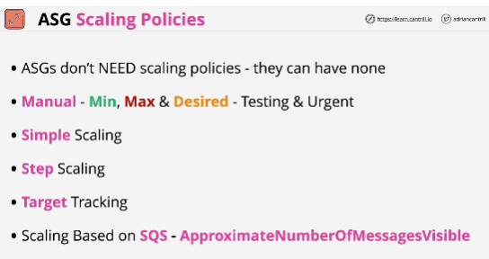
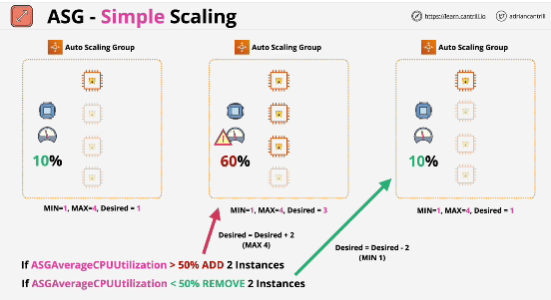
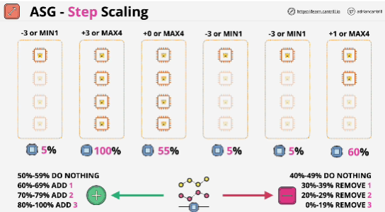

- Scaling policies can be created without any Auto Scaling Policies.

- **Simple scaling**: with this you define actions which occur when an alarm moves into an alarm state. This scaling is *inflexible*

- **Step scaling**: increases or decreases the desired capacity based on a set of scaling adjustments, known as step adjustments that vary based on the size of he alarm breach.

- **Target tracking**: comes with a predefined set of metrics.

- **Scaling based on SQS**: you can increase or decrease capacity based on approximate number of messages visible.

