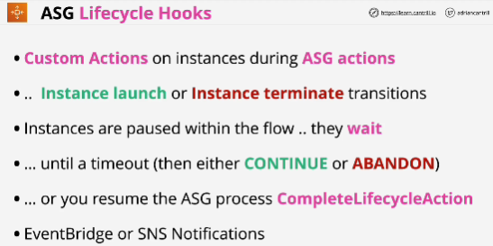
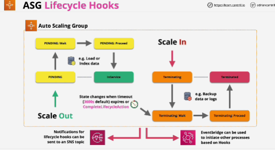

- Lifecycle Hooks allow you to configure custom actions which can occur during Auto Scaling group actions.

- Lifecycle Hooks can be integrated with **EventBridge or SNS Notifications** which allow your systems to perform event driven processing based on the launch or termination of EC2 instances within an Auto Scaling group.

