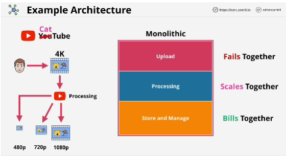
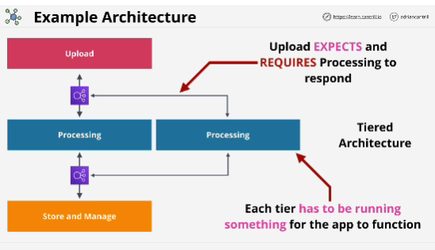
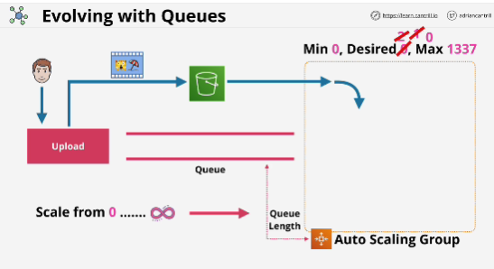
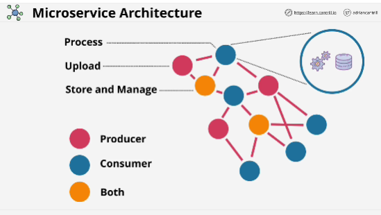
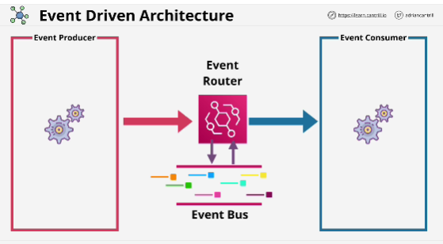
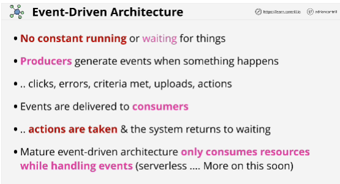

- **Monolithic application**: all the components of the application in one (black) box. 
    - If one component fils it impacts the whole thing end to end.
    - All components except to be on the same server directly connected, and have the same codebase.
    - You need to *vertically* scale the system because everything excpets to be running on the same piece of compute hardware.

- With a **tiered** architecture, the monolith is broken apart, and we have a collection of different tiers.
- Benfit with tiered: individual tiers can be scaled vertically independently.

--------------

- **Event Driven Architectures** are collection of event producers which might be components of your application which directly interact with customers or they might be parts of your infrastructure such as EC2 or they might be systems monitoring components.

- Producers are things which produce events and the inverse of this are consumers.

- Components, within an application, can be both producers and consumers.

- Neither producers or consumers wait for things to occur. They are not constantly consuming resources.

- **Event Router** a highly available, central exchange point for events.

Event Driven Architectures only consume resources as and when required.

