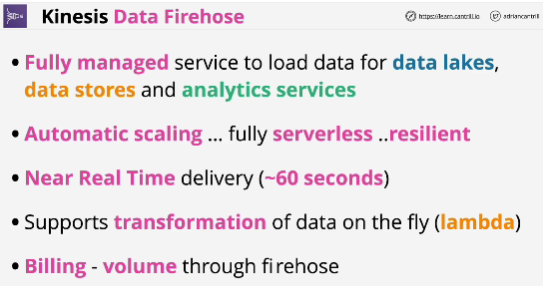
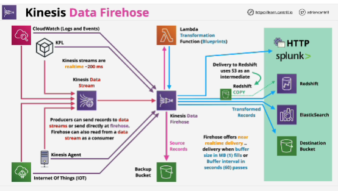

- **Kinesis Data Firehose** is a stream based delivery service capable of delivering high throughput streaming data to supported destinations in near realtime.

- Support services like S3.

- **It is not real product. It is a near-real time product.**

- Pay as you go service

- Kinesis data streams are real time, but Firehose is what's known as a near-real time service.

- **Even though Firehose gets data in real time, it doesn't deliver it to the destination in real time.**

- From AWS perspective, something in the range of 200 milliseconds would be a real time product, but something in the range of 60 seconds would be classified as near-real time.

- Once the buffer or time buffer passes, then data is passed into the final destinations.

- Only exception for delivery is when you are using Redshift. It uses intermediate S3 bucket and then runs a Redshift copy to bring the data from S3 into the product.

