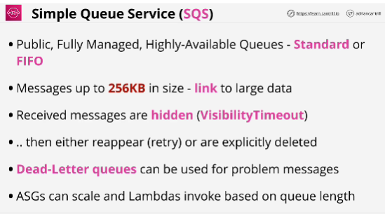
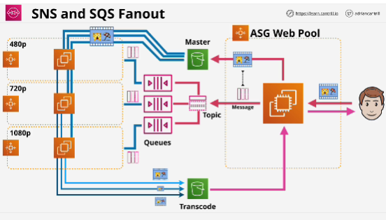
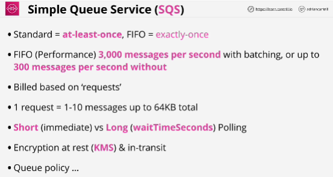

- **SQS queues** are a managed message queue service in AWS which help to decouple application components, allow Asynchronous messaging or the implementation of worker pools.

- **FIFO queue** guarantee an order.
- **Standard queue** there is possibility that messages could be received out of order.

- *Polling* is the process of checking for any messages on a queue.

- **Visibility timeout** is the amount of time that a client can take to process a message in some way. 
Amount of time that a message is hidden when it's received.
If it's not explicitly deleted then it appears back in the queue to be processed again.

- S3 buckets are capable of generating an event when an object is uploaded to that bucket, but it can only genereate one event. 

- Request is not the same as message. A request is a single request that you make to SQS.

- **Short polling**: uses one request and it can receive zero or more messages, but if the queue has zero messages on that queue that it stil consumes a request and it immediately returns zero messages. 

- **Long polling**: you can specify waitTimeSeconds (up to 20 seconds); if messages are available on the queue, when you lodge the request then they will be received. 

