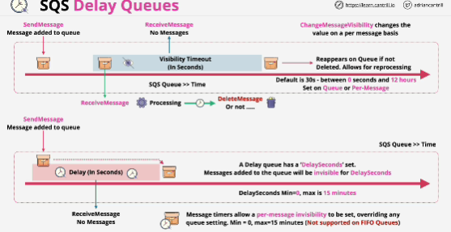

- **Delay queues** provide an initial period of invisibility for messages. Predefine periods can ensure that processing of messages doesn't begin until this period has expired.

- Visibility timeout: messages need to appear on the queue and be received before the visibility timeout occurs.
Genereally used for error correction and automatic reprocessing. 

- With delay queue we configure a value called DelaySeconds on queue. Messages which are added to queue will start off in an invisible state for that period of time. 

Once the period expires, the message will be visible on the queue. 

- Both features make messages unavailable to consumers for a specific period of time. 

- Difference: for delay queues, message is hidden automatically when it's first added to the queue.

