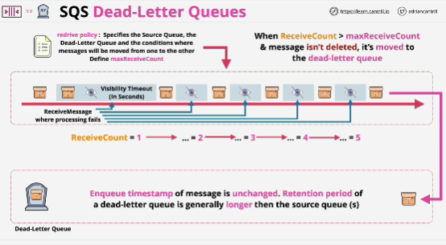

- Designed to help you handle reoccurring failures while processing messages which are within an SQS queue.

- All SQS queues have retention periods for messages.

- When message is added to a queue, it has an enqueue timestamp, timestamp of the pooint that it was sent into the queue.

- Retention period of dead-letter queues should be longer than source queues, and this takes into account that the enqueue timestamp is not updated when the message is moved between queues.

