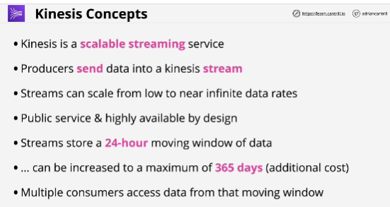
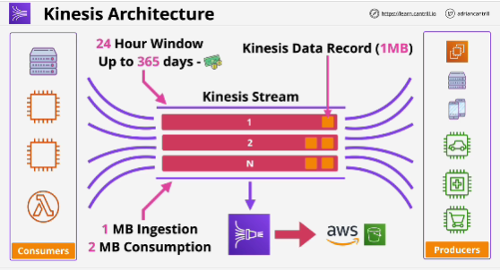
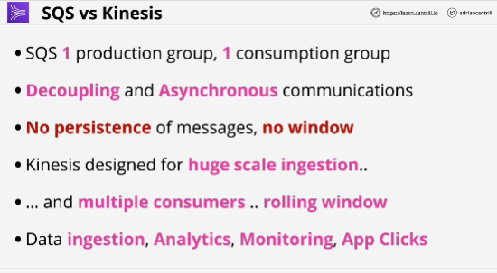

- **Kinesis data streams** are a streaming service within AWS designed to ingest large quantities of data and allow access to that data for consumers.

- Kinesis is ideal for dashboards and large scale real time analytics needs.

- Kinesis data firehose allows the long term persistent storage of kinesis data onto services like S3

- The way Kinesis Stream scales is by using **shared architecture**.
Each shard provides its own capacity. 

- The more shard a stream has, the more expansive it is, and the more performance that it provides.

- The way the data is stored is via **Kinesis Data Records**, and this have a maximum size of one MB.

## SQS vs Kinesis
- Ingestion of data: Kinesis
- Worker pools, decoupling, asynchronous communications: SQS

