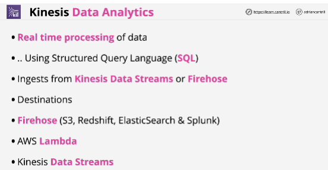
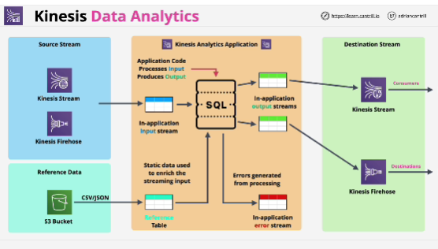
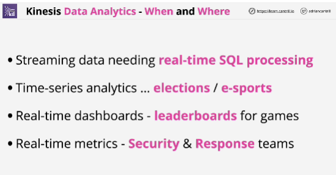

- Kinesis data streams are used to allow the large-scale ingestion of data into AWS and the consumtion of that data by other compute resources known as consumers.

- Kinesis DataFirehose provides delivery services. It accepts data in and then delivers it to supported destinations in near real-time.

- **Kinesis Data Analytics** is a service which provides real-time processing of data which flows through it uses the SQL. 

- Kinesis Data Analytics doesn't actually modify the sources in any way.

- Amazon Kinesis Data Analytics is the easiest way to analyze streaming data, gain actionable insights, and respond to your business and customer needs in real time.

- Core to the Kinesis Analytics is the application code which is coded using SQL. 

