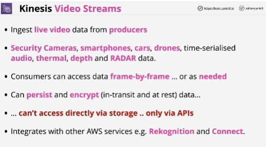
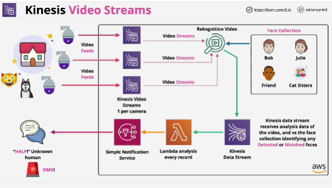

## EXAM
- You can't access the data directly that's ingested by Kinesis Video Streams. It's not stored in its original format.

It's all been indexed and stored in a structured way inside the product.

Also, you can't directly access the data on storage such as EBS, S3, EFS. You have to go via the product itself.

- Live video stream, analytics that needs to be performed on that video stream, GStreamer, RTSP -> **Kinsesis Video Streams**

