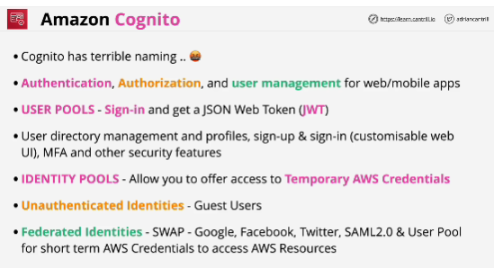
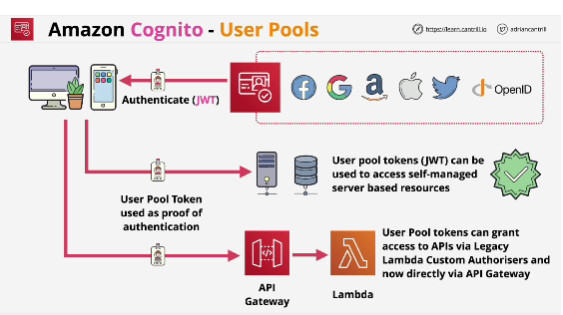
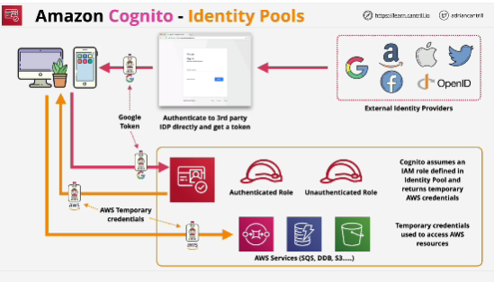
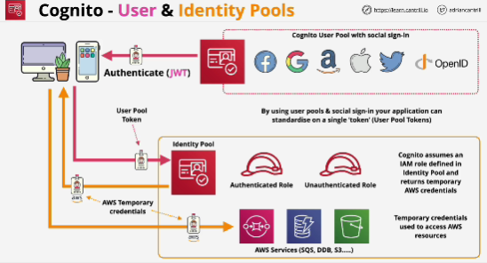

- A **user pool** is a user directory in **Amazon Cognito**. With a user pool, your users can sign in to your web or mobile app through Amazon Cognito. Your users can also sign in through social identity providers like Google, Facebook, Amazon, or Apple, and through SAML identity providers. Whether your users sign in directly or through a third party, all members of the user pool have a directory profile that you can access through a Software Development Kit (SDK).

- **Amazon Cognito identity pools** (federated identities) enable you to create unique identities for your users and federate them with identity providers. With an identity pool, you can obtain temporary, limited-privilege AWS credentials to access other AWS services. 

- Most AWS services cannot use JWT's (JSON Web Token), you need actual AWS credentials.

- User pools do not grant access to AWS services, their job is to control sign in and deliver a JWT.

- **User pools** are about offering a joined up sign up, or sign in experience with user directory and profile management services, so it's about login and about managing user identities.

- **Identity pools** are about swapping either an unauthenticated, or authenticated identity for AWS credentials. 

Identity pools work by assuming an IAM role on behalf of the identity. 

- API gateway is capable of accepting JWT's for authentication.

- User poll is a collection of identities of users, it's used to allow sign up and sign in both for internal users and social sign in. 
The tokens, which are generated as a result can be used for self-managed systems, and the token can be used to authenticate for API gateway. 
**This tokens cannot be used to access AWS resources.**
That requires AWS credentials.

## Identity pools
- If we want to support five external ID providers, we need five different configurations. 

- User pool manage user signup and user sign in either internal or using social logins.
As a result, you get a user pool token also known as JSON Web Token or JWT and that is the output of any form of sign in using user pools. 

- Identity pools swap external identity tokens for AWS credentials, this process is called federation. 

- External identity tokens can be direct external identity tokens such as Google, Amazon, Facebook and many others, or they can be user pool tokens which can themselves represent external ID logins.

