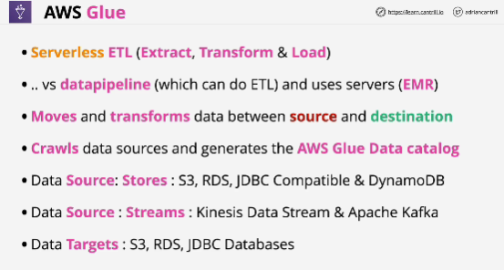
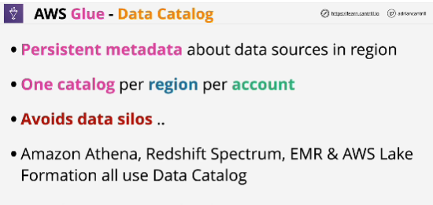
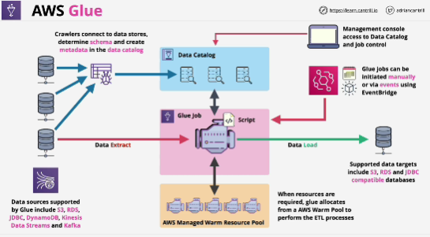

- **AWS Glue** is a fully managed extract, transform, and load (ETL) service that makes it easy for customers to prepare and load their data for analytics.

- **Data catalog** is a collection of metadata combined with data managment and search tools. 

Data catalog is also used as part of Glue jobs.
- **Glue jobs** are extract, transform and load jobs. Data is extracted from source and then loaded into a destination.

- Glue is *servereless* and you don't need to manage the compute which is used to perform the transformation. 

- Serverless, ad hoc or cost-effective -> GLUE

