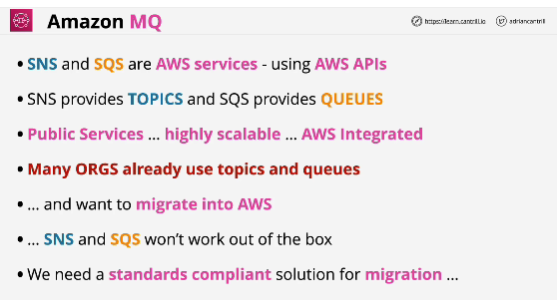
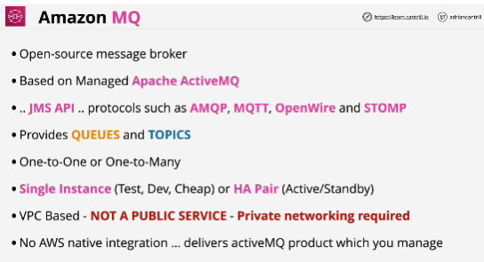
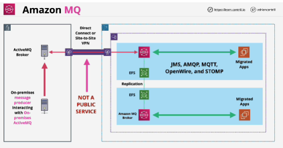
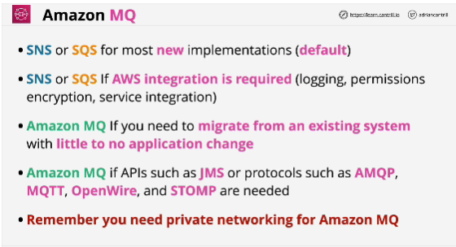
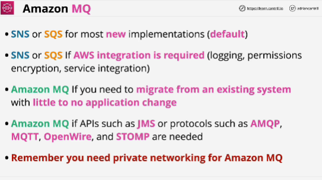

- **Amazon MQ is private service. You need a private network connection between your on-premises environmen and AWS.**
On-premises broker and the AWS managed pair can communicate over connection. 

- **You need private networking if you want to use Amazon MQ.**

- Hybrid style scenarios where an existing system exists on premises and you need to migrate from it into AWS or establish coexistence with that existing system -> AMAZON MQ

