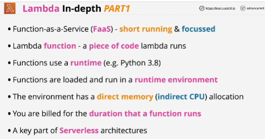
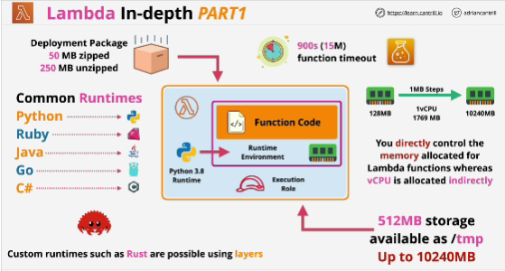
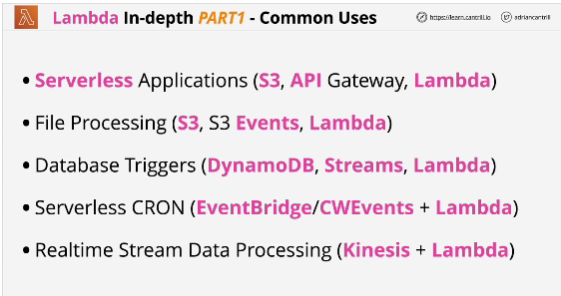

- When you create a Lambda function, you need to define which runtime that piece of code uses.

- Designed for short-running and focused functions.

- Lambda function is a deployment package which Lambda executes.
- When creating Lambda function you define:
    - language which the function is written in
    - Lambda with a deployment package
    - set resources

## EXAM
Docker -> consider this to mean not Lambda; Docker is an anti-pattern for Lambda.

Docker = traditional contsinerized computing

You can use container images with Lamba: that means that you're using your existing container build proccesses. the same ones that you use to create Docker images, but instead you're creating specific images designed to run inside the Lambda environment.

----------

- You select runtime to use when creating the function and this determines the components which are available inside the runtime environment.

- Lambda functions are stateless, which means no data is left from a previous invocation. 

- Every time a function is invoked, it's a brand new invocation, a brend new environment.

- Lambda runtime environments have no state.

- Resources: define the memory (from 128 MB to 10240 MB in one MB steps)

- Less memory, less virtual CPUs, more memory means additional CPU capacity.

- Lambda functions can run for up to 900 seconds, or 15 minutes and this is known as **the function timeout**.

**Everything beyond 15 minutes, you can not use Lambda directly.**

