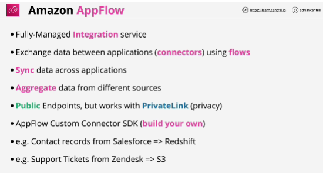
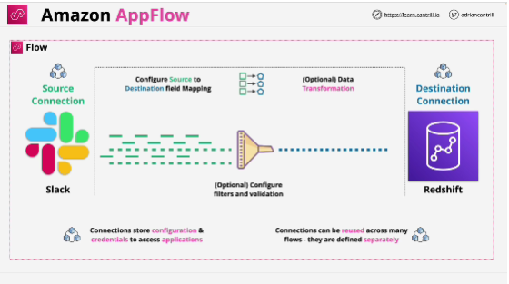

- **Amazon AppFlow** allows you to exchange data between applications using flows. 

- Main configuration of the product is a **flow**.
Flow consists of a source connector and destination connector and other optional components. 

- By default, the service uses **public endpoints** which allows it to interact with public SaaS applications, but it can work using PrivateLink to access private sources. 

