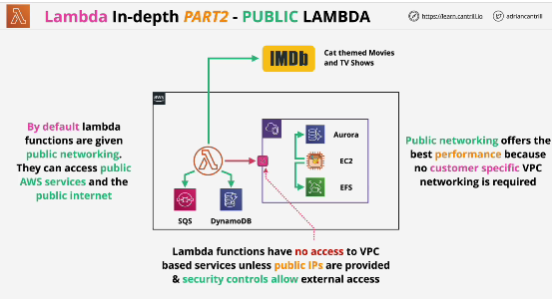
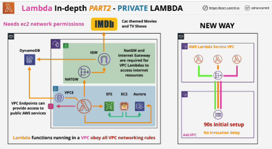
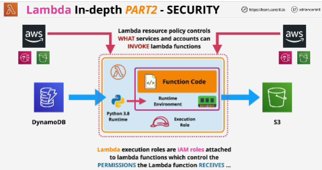
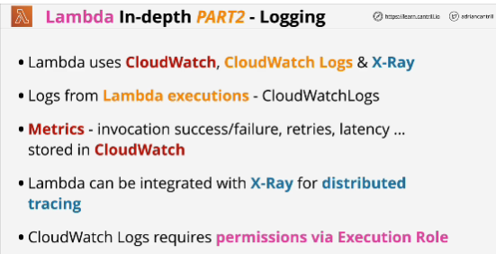

- Lambda has **two networking modes**:
1. public - default; 
    - Lambda running by default using public networking means that it has nework connectivity to public space AWS sevices and the public internet
    - Public networking offers the best performance for Lambda because no customer specific networking is required. 
    - Lambda functions have **no access** to VPC

- **EXAM** -> Lambdas running inside a VPC obey all of the same rules as anything else running in a VPC because they're actually running within that VPC.

- One ENI is reqiured in the VPC. If all your functions used a collection of subnets, but the same security groups, then one network interface would be required per subnet. 

- Single connection between the Lambda Service VPC and your VPC is created for every unique combination of secutriy groups and subnets used by your Lambda functions. 

2. VPC networking

## Security
- Lambda has resource policy. It controls who can interact with a specific Lambda function. 

- The resource policy is something changed when you integrate other services with Lambda and you can manually change it via he CLI or the API. 

- **EXAM** -> For Lambda to be able to log into CloudWatch logs to generate the output of any of the executions, you need to give Lambda permissions via the exectution role.

