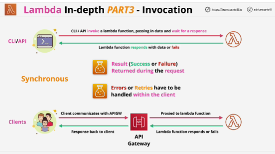
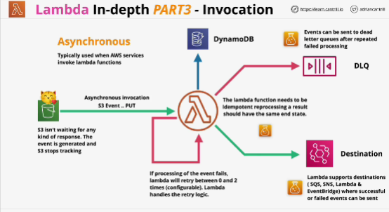
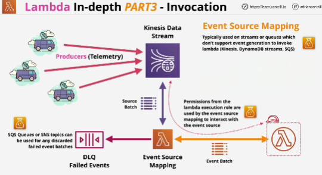
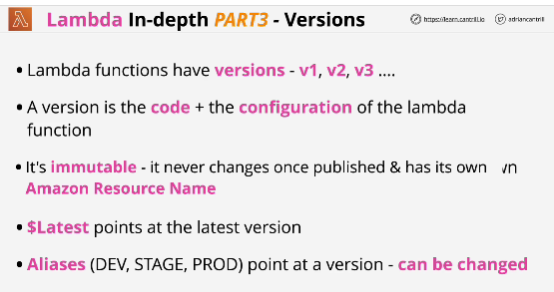
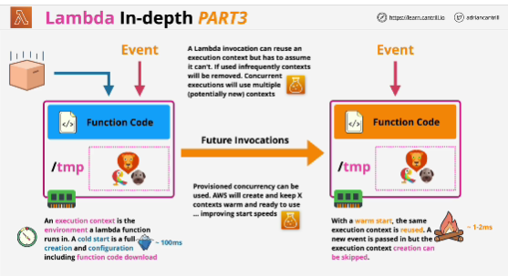

- **Three methods** of invoking Lambda function:

1. **Synchronous invocation**
2. **Asynchronous invocation**
3. **Event Source Mapping**

## **Synchronous invocation**
- Client sends a request which invokes Lambda, and the result, be it a success or failure, is returned during that initial request, the client is waiting for any data to be returned.

- Any errors or retries have to be handled within the client.

- Generally used when it's human directly or indirectly invoking a Lambda function. 

## **Asynchronous invocation**
- Used when AWS services invoke Lambda functions on your behalf.

- *Idempotent operation* -> you can run it as many times as you want and the outcome will be the same.

- Lambda can automatically reprocess failed events and the original source of the event isn't waiting for processing to complete.

## **Event Source Mapping**
- Used on Streams or queues, which don't generate events.

- Kinesis is a Stream-based product. Consumers can read from a Stream, but it doesn't generate events when data is added.

## Lambda versions

## Lambda startup times
- If the same Lambda function is invoked again without too much of a gap, then it's possible that Lambda will use the same execution context. (warm start)

- Anything you define within a Lambda function handler is limited to that one specific invocation at that Lambda function, but for anything which you anticipate there being a potential for reuse, you can declare that outside of the Lambda function handler, and in theory, that will be available for any other invoacations of the Lambda function, which occur within that same execution context.

