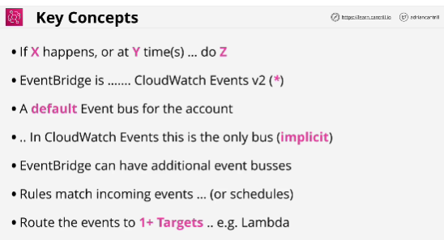
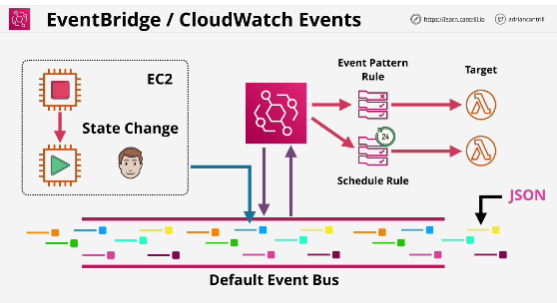

- **EventBridge** is the service which is replacing CloudWatch Events. It can handle events from third-parties as well as custom applications.

- **X** is supported service, which generates an event, it's producer of an event. 
- **Y** can be a certain time or time periods (specified using UNIX cron format)
- **Z** is a supported target service to deliver the event to

- They can monitor the default account event bus - and pattern match events flowing through and deliver these events to multiple targets.

They are also the source of scheduled events which can perform certain actions at certain times of day, days of the week, or multiple combinations of both - using the Unix CRON time expression format.

Both services are one way how event driven architectures can be implemented within AWS.