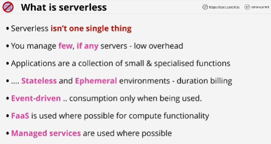
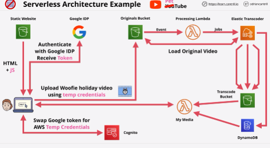

- It's more software than hardware architecture

- **Serverless** takes the best bits from a few defferent architectures, mostly microservices and event-driven architectures.

- Within serverless you break an application down into as many tiny pieces as possible, even beyond microservices, collections of small and specialized functions.

- Everything is event-driven: nothing is running until it's required.

