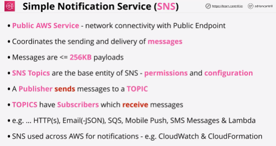
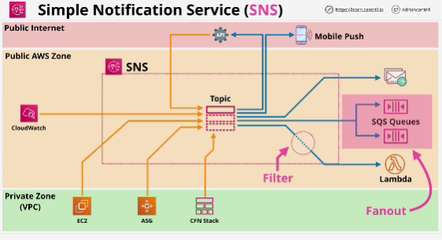
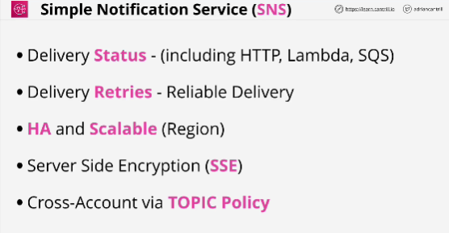

- The Simple Notification Service or SNS .. is a PUB SUB style notification system which is used within AWS products and services but can also form an essential part of serverless, event-driven and traditional application architectures.

- Publishers send messages to TOPICS

- Subscribers receive messages SENT to TOPICS.

- SNS supports a wide variety of subscriber types including other AWS services such as LAMBDA and SQS.

- You can create topics inside of SNS. 
- The topic has subsribers and things can be subscribers and producers at the same time. (APIs)

- *Fanout architecture*: when you have a single SNS topic with multiple SQS queues as subscribers.

